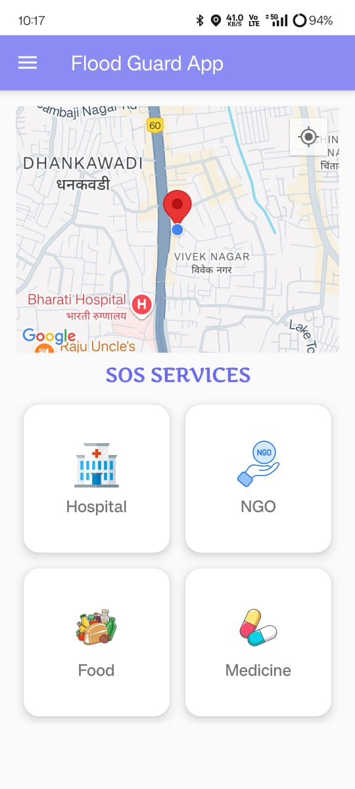
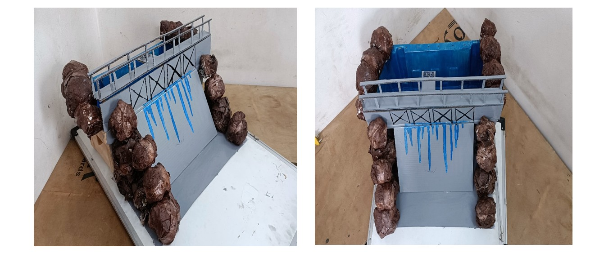

# 🌊 Flood Detection and Monitoring Using IoT

This project aims to detect and monitor flood conditions using IoT sensors and machine learning techniques. A mobile application alerts local users about flood risks and provides emergency support through an SOS feature.

---

## 🎯 Objective

To provide early flood alerts by combining real-time water level monitoring, weather data, and intelligent flood prediction, ultimately helping local people take timely action.

---

## ⚙️ Technologies Used

### 📡 IoT Components
- **Ultrasonic Sensor** – Monitors water level
- **NodeMCU ESP8266** – Sends data to the cloud
- **Firebase** – Connects IoT data with the mobile app

### 🧠 Machine Learning
- **Algorithm Used**: Random Forest  
- **Purpose**: Predicts flood risk based on sensor data and weather input

### 📱 Android Application
- Developed using **Java**
- Alerts users based on dam water level and prediction
- **Features**:
  - Flood risk prediction
  - Nearby hospital locator
  - Emergency SOS button
  - Chatbot and user authentication (sign up/sign in)
  - Weather information and safety tips

---

## 📷 App Screenshots

| About App | Sign In | Sign Up |
|-----------|---------|---------|
|  |  |  |

| Home Page | Home Page 2 | My Account |
|-----------|--------------|------------|
|  |  |  |

| Flood Prediction | Chatbot | SOS |
|------------------|---------|-----|
|  |  |  |

| SOS Hospital | Side Bar | YT Videos |
|--------------|----------|-----------|
|  |  |  |

---

## 🛠️ Physical Model

The system was physically built using microcontroller components and sensors as shown below:

---

## 📃 Submitted As

- **Final Year Project - B.E. (Information Technology)**  
- **Academic Year**: 2024–2025  
- **College**: *RMD Sinhgad School of Engineering*

---

> 🔐 _Android app source code and Embedded C code are not shared to maintain project originality. This repo is for showcasing screenshots and documentation only._
